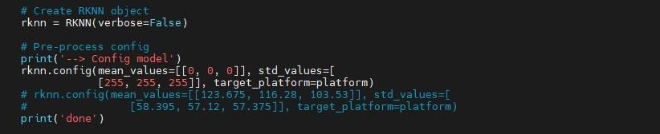

# FAQ

## 1. How to debug code?

- Debug code. Import the `logger` package and use `LOGGER.info` to output logs. Example as follows:

```python
from logger import LOGGER

LOGGER.info('boxes:{},classes:{},scores:{}'.format(boxes, classes, scores))
```

## 2. What if the custom algorithm package does not trigger alarms?

If the algorithm package has been correctly imported into the intelligent analysis device but no alarms are generated, troubleshoot as follows:

- First, check whether the configuration files are modified correctly one by one according to the modification requirements in the configuration files of the corresponding example algorithm package.

- If the modifications are correct, check whether there are errors in the `engine` and `filter` logs. You can fix issues by adding debug logs.

- If the algorithm inference (`engine`) and post-processing (`filter`) logs are normal but there are still no alarm results:

    - Use the original untransformed training files to perform inference and check if the model can detect targets.

    - Check whether parameters such as mean and variance were modified correctly during quantization.

    

    - Check for issues in `ONNX` conversion, such as ensuring static input and output if required.

