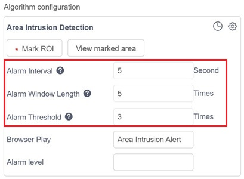
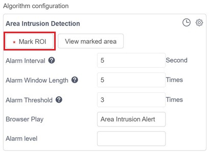
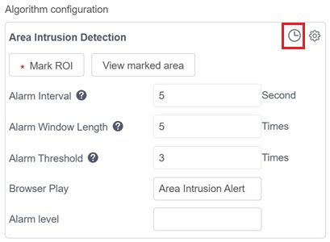
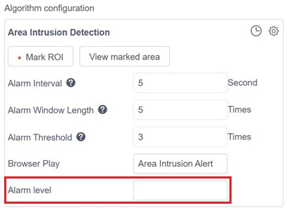
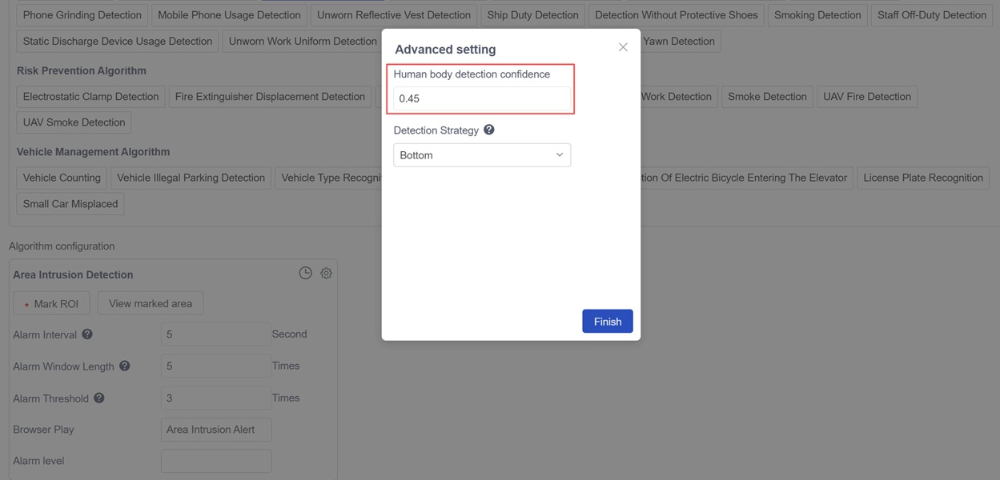
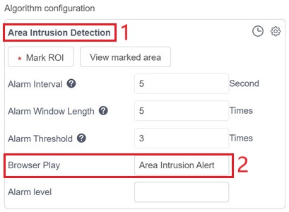
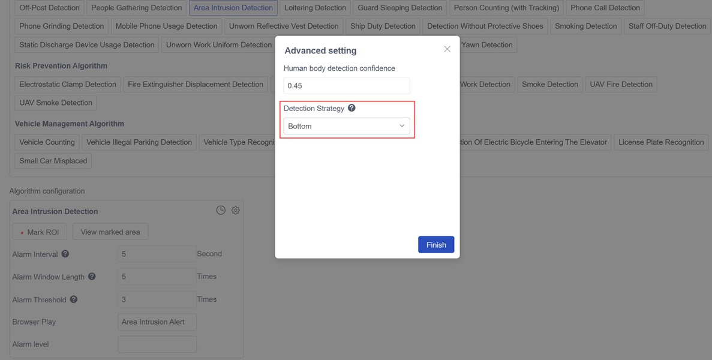

# Front-End Configuration File Parameter Description

The configuration file consists of two main sections: `basicParams` and `renderParams`。

## basicParams 

The structure and contents of `basicParams` are as follows:

```
{
    "alert_window": {
        "type": "interval_threshold_window",
        "interval": 5,
        "length": 5,
        "threshold": 3
    },
    "bbox": {
        "polygons": [],
        "lines": []
    },
    "plan": {
        "1": [[0, 86400]],
        "2": [[0, 86400]],
        "3": [[0, 86400]],
        "4": [[0, 86400]],
        "5": [[0, 86400]],
        "6": [[0, 86400]],
        "7": [[0, 86400]]
    },
    "hazard_level": "",
    "alg_type": "general",
    "model_args": {
        "zql_person": {
            "conf_thres": 0.65
        }
    },
    "reserved_args": {
        "display_name": "Area Intrusion Detection",
        "sound_text": "Area Intrusion Alert",
        "strategy": "bottom"
    }
}
```

`basicParams` is divided into seven modules: `alert_window`、`bbox`、`plan`、`hazard_level`、`alg_type`、`model_args`、`reserved_args`. All seven modules are required, but users can modify the parameter values within each module as needed. If users wish to add custom parameters, they can do so within the `reserved_args` module.

### alert_window

This parameter corresponds to the interface configuration:  
  

`alert_window`defines the type of alert trigger window. The `type` field specifies the window type, and different types have different parameter sets. Currently, two types of windows are supported:

#### interval_threshold_window

* `interval`: The alert interval, used to control the frequency of alerts.
Example: If set to 5 seconds, once an alert is triggered for a given camera and algorithm, no additional alerts will be generated within the next 5 seconds.
* `length`: The alert window length, representing the evaluation period for determining whether to trigger an alert. Example: If set to 5 (times/seconds), the system must continuously analyze 5 frames (or seconds) before deciding whether to raise an alert.
Reducing this value will make the system more responsive but may increase false positives.
* `threshold`: The alert threshold, usually used together with the alert window length.
For example, if the alert window length is set to 5 (times/seconds) and the threshold is set to 3 (times/seconds), it means that within the 5-time (second) window, as long as the algorithm detects hits in 3 or more instances, an alert will be triggered.

When `length` and `threshold` are set to `5` and `3` respectively, the window semantics are: An alert is triggered if 3 or more detections occur within 5 consecutive checks.

The `interval` parameter controls the alert frequency (in seconds).

When `length` / `threshold` / `interval` are set to `5` / `3` / `5`, the semantics are: If 3 or more detections occur within 5 consecutive checks, an alert is triggered; however, after an alert is reported, no new alerts will be reported within the next 5 seconds.

This configuration is applicable to most algorithms.

#### interval_duration_window

* `duration`: Window length (in seconds).
* `interval`，Minimum time interval between two consecutive alerts (in seconds).

When `duration` and `interval` are set to `10` and `20` respectively, the semantics are:
If all detections within a continuous 10-second period are positive, an alert is triggered; after an alert is reported, no new alerts will be reported within the next 20 seconds.

This configuration is suitable for algorithms that require continuous triggering over a period of time to determine an alert, such as absence detection.

### bbox

This parameter corresponds to the interface configuration:
  

`bbox` defines the editable geometric shapes that users can draw on the captured image from the data source. These geometric regions can participate in the algorithm’s post-processing logic and can also be displayed in alert images or live video feeds.  
Currently, two types of geometric shapes are supported.

#### polygons

Supports multiple polygons simultaneously, and each polygon must contain at least three vertices.

#### lines

Supports multiple line segments simultaneously.

### plan

This parameter corresponds to the interface configuration:
  

`plan` is used to define the scheduling plan for the algorithm.
Only alerts generated within the defined schedule will be reported. 

### hazard_level

This parameter corresponds to the interface configuration:
  

`hazard_level` is used to define the alert hazard level.
The value is a string, and when an alert is triggered, both the alert message and the alert image will include the corresponding `hazard_level` information.

### alg_type

`alg_type` defines the type of algorithm. Different algorithm types have distinct post-processing workflows.  
Currently, seven algorithm types are supported:

* `general`: General type. suitable for most algorithms。

* `counting`: Counting type. This type of algorithm lists the counting statistics of specified regions in the alert message, alert result, and real-time display.  
Applicable examples include crowd gathering detection and post monitoring.

* `cross_line_counting`: Cross-line counting type. When a detected target crosses a calibrated line segment from one side to the other, a counting event is triggered.
This type lists the counting statistics for each defined line segment in the alert message, alert result, and live view.  
Applicable examples include `People Counting` and `Vehicle Counting`.
Note: When using counting algorithms, combined with `interval_threshold_window`, the parameters `length`, `threshold`, and `interval` must be set to `1`, `1`, and `0`, respectively.

* `match_face`: Face Library matching type. This type requires selecting a face database during configuration. Detected face images and the matched faces from the database will be displayed in the alert message and alert result.  
Applicable example: `Face Recognition`.

* `match_work_clothes`: Work Clothes Library matching type. This type requires selecting a work-clothes database during configuration.  
Applicable example: `Unworn Work Uniform Detection`.

* `match_ppe`: PPE Library matching type. This type requires selecting a PPE database during configuration.  
Applicable examples include `Detection Without Wearing Goggles`, `Testing Without Gloves`, and `Detection Without Protective Shoes`.

* `match_open_lib`: Open Library matching type. This type requires selecting an open-lib database during configuration.  
Applicable example: `Fire Exit Occupancy Detection`.

### model_args

This parameter corresponds to the interface configuration:    
  

`model_args` defines the parameters and default values used by the algorithm’s model.
The data structure is as follows:

```
"model_args": {
    "zql_person": {
        "conf_thres": 0.65
    }
}
```

### reserved_args

This parameter corresponds to the interface configuration:      
  

`reserved_args` is mainly used to define user-defined fields. These fields and their values can be passed into the post-processing logic, allowing users to implement their own custom algorithm logic.

- `display_name`：As shown in【1】above, the display name of the algorithm (required).
- `sound_text`：As shown in【2】above, the name used for browser voice broadcast (required).
- `strategy`：As shown in【3】below, a parameter used in the algorithm’s post-processing logic (optional).  

  

## renderParams

The `renderParams` section is divided into four modules: `alert_window`、`bbox`、`model_args` and `reserved_args`. Each module corresponds to and is used to render the associated part of `basicParams`.  
The format of `renderParams` is as follows:

```
{
    "alert_window": {
        "interval": {
            "label": "Alarm Interval",
            "unit": "Second",
            "tooltip": "Used to set the alarm frequency. For example, setting it to 5 seconds means that after an alarm is triggered by the algorithm under this camera, no further alarms will be generated within the next 5 seconds.",
            "type": "number",
            "range": {
                "min": 0,
                "step": 1,
                "max": 99999999
            }
        },
        "length": {
            "label": "Alarm Window Length",
            "unit": "Times",
            "tooltip": "The judgment cycle for alarm events. For example, setting it to 5 times (seconds) means that the system needs to analyze for 5 consecutive seconds before deciding whether to trigger an alarm. If you want the alarm to be more sensitive, this value can be reduced, but it may lead to more false alarms.",
            "type": "number",
            "range": {
                "min": 0,
                "step": 1,
                "max": 100
            }
        },
        "threshold": {
            "label": "Alarm Threshold",
            "unit": "Times",
            "tooltip": "Usually used together with the alarm window length. For example, if the alarm window length is set to 5 seconds and the alarm threshold is set to 3 seconds, it means that within the 5-second time window, if the algorithm detects 3 seconds of hits, an alarm will be triggered.",
            "type": "number",
            "range": {
                "min": 0,
                "step": 1,
                "max": 100
            }
        }
    },
    "reserved_args": {
        "strategy": {
            "hide": true,
            "label": "Detection Strategy",
            "tooltip": "Selection of judgment points in the detection box. Center refers to using the center point of the detection box to determine whether it is within the detection area; Top, Bottom, Left, and Right refer to using the midpoint of the top edge, bottom edge, left side, and right side of the detection box to determine whether it is within the detection area.",
            "type": "select",
            "options": [{
                    "label": "Top",
                    "value": "top"
                }, {
                    "label": "Center",
                    "value": "center"
                }, {
                    "label": "Bottom",
                    "value": "bottom"
                }, {
                    "label": "Left",
                    "value": "left"
                }, {
                    "label": "Right",
                    "value": "right"
                }
            ]
        },
        "sound_text": {
            "label": "Browser Play",
            "type": "text",
            "maxLength": 20
        }
    },
    "bbox": {
        "polygons": {
            "exits": "must",
            "max": -1,
            "edge": -1
        }
    },
    "model_args": {
        "zql_person": {
            "conf_thres": {
                "label": "Human body detection confidence",
                "unit": "",
                "tooltip": "If high detection accuracy is required and you want to avoid too many false positives, you can raise the confidence threshold. If the application scenario requires detecting as many humans as possible, you can choose a lower confidence threshold. This will make the system more likely to consider an area as a human, thus improving the recall rate, but it may also lead to more false positives.",
                    "type": "number",
                "range": {
                    "min": 0,
                    "step": 0.01,
                    "max": 1
                }
            }
        }
    }
}
```
### alert_window

This parameter corresponds to the interface configuration:  
  

`alert_window` is used to render the `alert_window` module in `basicParams`.

* `label`: As shown in the figure — e.g., `Alert Interval`, `Alert Window Length`, `Alert Threshold` — defines the parameter name.
* `unit`: As shown in the figure — e.g., seconds, times — defines the unit of measurement.
* `tooltip`: The question mark icon after the parameter name in the figure, used to provide an explanatory description of the parameter.
* `type`: Possible values: `number`/`select`/`text`。
    - `number`: When `type` is `number`, a `range` must be configured, which includes the three fields: `min`, `max`, and `step`.
    - `select`: When `type` is `select`, an `options` list must be configured.
    - `text`: When `type` is `text`, a `maxLength` field must be configured.

### bbox

This parameter corresponds to the interface configuration:  
  

`bbox` is used to render the `bbox` module in `basicParams`.

#### polygons

* `exists`: Possible values: `must` / `optional`.  
    - `must`: A polygon must be drawn.  
    - `optional`: Drawing a polygon is optional.
* `max`: The maximum number of polygons that can be drawn.
    - `-1`: No limit.
    - `1`: Only one polygon can be drawn.
* `edge`: The number of edges for the polygon.
    - `-1`: No restriction.
    - `3`: Only triangles can be drawn, and so on.

#### lines

* `exists`: Possible values: `must` / `optional`.
    - `must`: A line segment must be drawn.
    - `optional`: Drawing a line segment is optional.
* `max`: The maximum number of line segments that can be drawn.
    - `-1`: No limit.
    - `1`: Only one line segment can be drawn.
* `cross`: Possible values: `true` / `false`.
    - `false`: Non-crossing line segments (i.e., ordinary lines).
    - `true`: Crossing line segments, applicable for algorithms such as people counting or vehicle counting.

### model_args

This parameter corresponds to the interface configuration:  
  

`model_args` is used to render the `model_args` module in `basicParams`.

* `label`: As shown in the figure (e.g., Human body detection confidence), defines the parameter name.
* `unit`：Defines the unit of measurement (optional).
* `tooltip`：The question mark icon after the parameter name, used to provide an explanation of the parameter.
* `type`：Possible values: `number` / `select` / `text`.
    - `number`: When `type` is number, a `range` must be configured, which includes the three fields: `min`, `max`, and `step`.
    - `select`: When `type` is select, an `options` list must be configured.
    - `text`: When `type` is text, a `maxLength` field must be configured.

### reserved_args

This parameter corresponds to the interface configuration:  
  

`reserved_args` is used to render the `reserved_args` module in `basicParams`.

Special attention should be given to the `type` field. The possible values for `type` are: `number` / `select` / `text`.

* `hide`: When set to `true`, the parameter appears under `Advanced Settings`;
when set to `false`, the parameter appears on the `Algorithm Configuration` page.
* Other parameters follow the same configuration rules as those in `model_args`.
