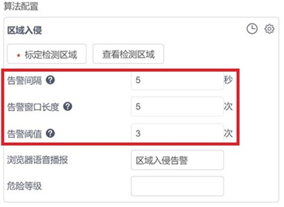
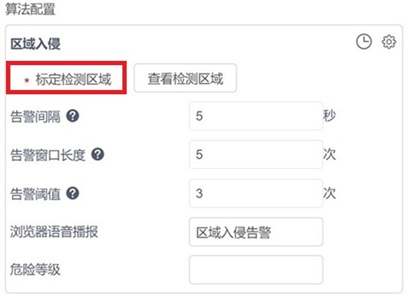
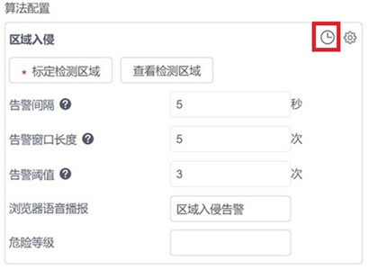
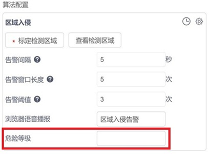
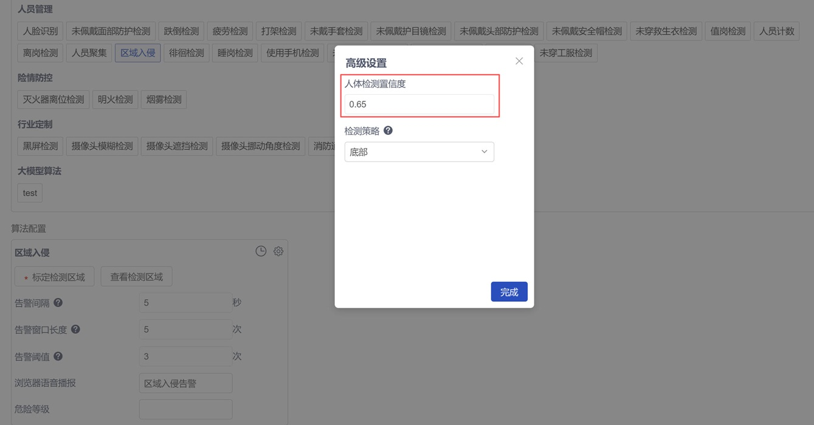
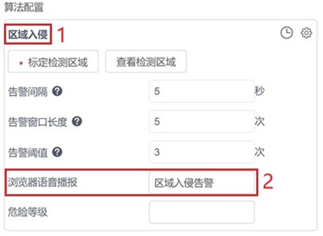
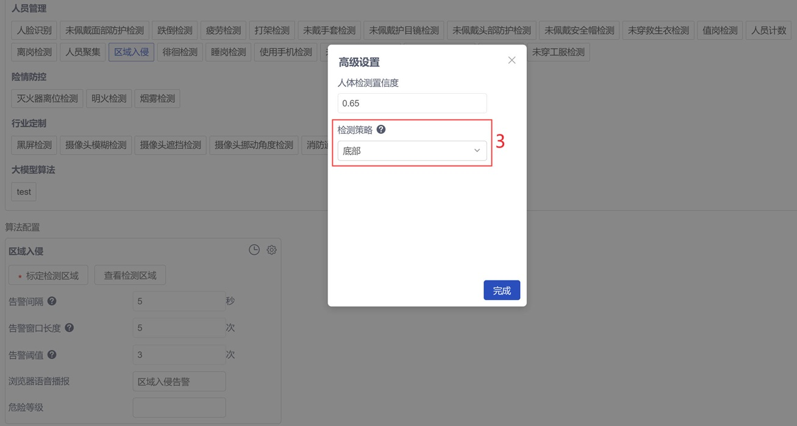

# 前端配置文件参数说明

配置文件内容包含两部分：`basicParams` 和 `renderParams`。

## basicParams 

`basicParams`格式及内容如下：

```
{
    "alert_window": {
        "type": "interval_threshold_window",
        "interval": 5,
        "length": 5,
        "threshold": 3
    },
    "bbox": {
        "polygons": [],
        "lines": []
    },
    "plan": {
        "1": [[0, 86400]],
        "2": [[0, 86400]],
        "3": [[0, 86400]],
        "4": [[0, 86400]],
        "5": [[0, 86400]],
        "6": [[0, 86400]],
        "7": [[0, 86400]]
    },
    "hazard_level": "",
    "alg_type": "general",
    "model_args": {
        "zql_person": {
            "conf_thres": 0.65
        }
    },
    "reserved_args": {
        "display_name": "区域入侵",
        "sound_text": "区域入侵告警",
        "strategy": "bottom"
    }
}
```

`basicParams`内容分为7个模块：`alert_window`、`bbox`、`plan`、`hazard_level`、`alg_type`、`model_args`、`reserved_args`，这7个模块必须存在，用户可根据需求自行修改模块中参数的值。若用户需要添加一些自定义参数，可以在`reserved_args`模块中添加。

### alert_window

该参数对应的界面配置：  
  

`alert_window`定义了告警触发的窗口类型，其中`type`字段定义了窗口的类型，不同类型的窗口拥有不同的参数种类，目前支持2种窗口类型：

#### interval_threshold_window

* `interval`：告警间隔，用于设置告警频率。例：设置5秒，则本次该摄像头下的该算法告警后，5秒内则不再产生告警。
* `length`：告警窗口长度，告警事件的判断周期。例：设置5次（秒），则需要连续分析5次（秒），才能决定是否告警。如果想要告警产生的更灵敏一些，该数值可以变小，但是可能会引发更多的误报。
* `threshold`：告警阈值，通常和告警窗口长度一起使用，如告警窗口长度设置5次（秒），告警阈值设置未3次（秒），则代表在5次（秒）的时间窗口内，只要算法识别到3次（秒）命中，则产生告警。

当`length`/`threshold`的值分别为`5`/`3`时，窗口的语义为：连续5次检测中命中了3次或以上，则产生一个告警。

`interval`参数，用于控制告警频率，单位是秒。

当`length`/`threshold`/`interval`的值分别为`5`/`3`/`5`时，窗口的语义为：连续5次检测中命中了3次或以上，则产生一个告警，在上报一个告警之后的5秒内所产生的新的告警将不会上报。

适用于大多数的算法。

#### interval_duration_window

* `duration`：窗口长度（秒）。
* `interval`：两次告警之间最短时间间隔（秒）。

当`duration`/`interval`的值分别为`10`/`20`时，窗口的语义为：在连续10秒内所有的检测全部命中，则产生一个告警，在上报一个告警之后的20秒内所产生的新的告警将不会上报。

适用于部分需要通过一段时间的连续触发来判定告警的算法，如：离岗检测。

### bbox

该参数对应的界面配置：  
  

`bbox`定义了用户在捕获的数据源图片中可编辑的几何形状，这些几何形状可参与算法后处理的逻辑判断，同时也可以在告警图片以及实时画面中显示出来，目前支持2种类型的几何图形：

#### polygons（多边形）

支持多个多边形并存，每个多边形的顶点数量不得小于3。

#### lines（线段）

支持多个线段并存。

### plan

该参数对应的界面配置：  
  

`plan`用于定义算法的布控时间计划，只有在布控计划范围之内产生的告警才会上报。

### hazard_level

该参数对应的界面配置：  
  

`hazard_level`用于定义告警的`危险等级`，格式为字符串，触发告警后告警报文以及告警图片中会携带`危险等级`。

### alg_type

`alg_type`定义了算法的类型，不同类型的算法其后处理流程不一样，目前支持7种算法类型：

* `general`：通用类型，适用于大部分算法。

* `counting`：计数类型，此类算法会在告警报文、告警结果、实时画面中罗列出指定区域的计数统计结果，适用算法如人员聚集、值岗检测等。

* `cross_line_counting`：跨线计数类型，当检测目标从标定的线段一侧跨越到另一侧时触发计数，此类算法会在告警报文、告警结果、实时画面中罗列出指定线段的计数统计结果，适用算法如：人员计数、车辆计数等。注意：计数类算法搭配`interval_threshold_window`使用，需设置`length`、`threshold`、`interval`为1，1，0。

* `match_face`：人脸匹配类型，此类算法在配置时需要选择人脸底库，并且会在告警报文、告警结果中将检测到的人脸图像及其命中的底库人脸图像罗列出来，适用算法：人脸检测。

* `match_work_clothes`：工服匹配类型，此类算法在配置时需要选择工服底库，适用算法：未穿戴工服检测。

* `match_ppe`：`ppe`匹配类型，此类算法在配置时需要选择`ppe`底库，适用算法：未佩戴护目镜检测、未戴手套检测、未穿工装鞋检测等。

* `match_open_lib`：`open_lib`匹配类型，此类算法在配置时需要选择`open_lib`底库，适用算法：消防通道占用检测。

### model_args

该参数对应的界面配置：  
  

`model_args`定义了算法所用到的模型的参数和默认值，数据结构如下：

```
"model_args": {
    "zql_person": {
        "conf_thres": 0.65
    }
}
```

### reserved_args

该参数对应的界面配置：  
  

`reserved_args`主要用于定义用户的自定义字段，这些字段及其值可以被传输到后处理逻辑里面，用于用户编写自己的算法逻辑。

- `display_name`：如上图【1】，算法显示名称，必填；
- `sound_text`：如上图【2】，浏览器语音播报名称，必填；
- `strategy`：如下图【3】，算法后处理中需要的参数，可选。  

  

## renderParams

`renderParams`部分的内容分为4个模块：`alert_window`、`bbox`、`model_args`、`reserved_args`，分别用于渲染`basicParams`部分与之对应的模块，`renderParams`的格式如下：

```
{
    "alert_window": {
        "interval": {
            "label": "告警间隔",
            "unit": "秒",
            "tooltip": "用于设置告警频率。例：设置5秒，则本次该摄像头下的该算法告警后，5秒内则不再产生告警。",
            "type": "number",
            "range": {
                "min": 0,
                "step": 1,
                "max": 99999999
            }
        },
        "length": {
            "label": "告警窗口长度",
            "unit": "次",
            "tooltip": "告警事件的判断周期。例：设置5次（秒），则需要连续分析5次（秒），才能决定是否告警。如果想要告警产生的更灵敏一些，该数值可以变小，但是可能会引发更多的误报。",
            "type": "number",
            "range": {
                "min": 0,
                "step": 1,
                "max": 100
            }
        },
        "threshold": {
            "label": "告警阈值",
            "unit": "次",
            "tooltip": "通常和告警窗口长度一起使用，如告警窗口长度设置5次（秒），告警阈值设置未3次（秒），则代表在5次（秒）的时间窗口内，只要算法识别到3次（秒）命中，则产生告警。",
            "type": "number",
            "range": {
                "min": 0,
                "step": 1,
                "max": 100
            }
        }
    },
    "reserved_args": {
        "strategy": {
            "hide": true,
            "label": "检测策略",
            "tooltip": "检测框判断点选择。中心，表示利用检测框中心点判断是否在检测区域内；顶部、底部、左侧、右侧，分别表示利用检测框上边缘中点、下边缘中点、左侧边中点、右侧边中点判断是否在检测区域内。",
            "type": "select",
            "options": [{
                    "label": "顶部",
                    "value": "top"
                }, {
                    "label": "中心",
                    "value": "center"
                }, {
                    "label": "底部",
                    "value": "bottom"
                }, {
                    "label": "左侧",
                    "value": "left"
                }, {
                    "label": "右侧",
                    "value": "right"
                }
            ]
        },
        "sound_text": {
            "label": "浏览器语音播报",
            "type": "text",
            "maxLength": 20
        }
    },
    "bbox": {
        "polygons": {
            "exits": "must",
            "max": -1,
            "edge": -1
        }
    },
    "model_args": {
        "zql_person": {
            "conf_thres": {
                "label": "人体检测置信度",
                "unit": "",
                "tooltip": "如果对检测精度要求较高，并且不希望过多的误报，可以将置信度阈值提高。如果应用场景中要求尽可能多地检测到人体，可以选择较低的置信度阈值。这将使得系统更容易认为某个区域是人体，从而提高召回率，但也可能带来更多的误报。",
                "type": "number",
                "range": {
                    "min": 0,
                    "step": 0.01,
                    "max": 1
                }
            }
        }
    }
}
```
### alert_window

该参数对应的界面配置：  
  

`alert_window`用于渲染`basicParams`的`alert_window`模块。

* `label`: 如图 `告警间隔`、`告警窗口长度`、`告警阈值`，用于定义参数名称；
* `unit`：如图 `秒`、`次`，用于定义参数单位；
* `tooltip`：如图参数名称后的问号，用于对该参数解释说明；
* `type`：可选值：`number`/`select`/`text`。
    - `number`，当`type`为`number`时需要配置`range`，`range`中需包含`min、max、step`这3个字段。
    - `select`，当`type`为`select`时需要配置`options`。
    - `text`，当`type`为`text`时需要配置`maxLength`。

### bbox

该参数对应的界面配置：  
  

`bbox`用于渲染`basicParams`的`bbox`模块。

#### polygons

* `exists`，可选值：`must`/`optional`，`must`表示必须画多边形，`optional`可画可不画多边形。
* `max`，表示最大可画多边形的数量，`-1`表示不限制数量，`1`表示最多只能画一个多边形。
* `edge`，表示边形边的数量，`-1`表示不做限制，`3`表示只能画三角形，以此类推。

#### lines

* `exists`，可选值：`must`/`optional`，`must`表示必须画线段，`optional`可画可不画线段。
* `max`，表示最大可画线段的数量，`-1`表示不限制数量，`1`表示最多只能画一个线段。
* `cross`，可选值`true`/`false`，`false`表示非跨线类线段（即普通线段）；`true`表示跨线类线段，适用算法如：人员计数、车辆技术等。

### model_args

该参数对应的界面配置：  
  

`model_args`用于渲染`basicParams`的`model_args`模块。

* `label`: 如图 `人体检测置信度`，用于定义参数名称；
* `unit`：用于定义参数单位， 可不填；
* `tooltip`：如图参数名称后的问号，用于对该参数解释说明；
* `type`：可选值：`number`/`select`/`text`。
    - `number`，当`type`为`number`时需要配置`range`，`range`中需包含`min、max、step`这3个字段。
    - `select`，当`type`为`select`时需要配置`options`。
    - `text`，当`type`为`text`时需要配置`maxLength`。

### reserved_args

该参数对应的界面配置：  
  

`reserved_args`用于渲染`basicParams`的`reserved_args`模块。

需要注意的是`type`字段，`type`字段的可选值：`number`/`select`/`text`。

* `hide`，为`true`时，该参数会在`高级设置`中显示；为`false`时，该参数在`算法配置`页面显示。
* 其他参数可参考 `model_args`。
