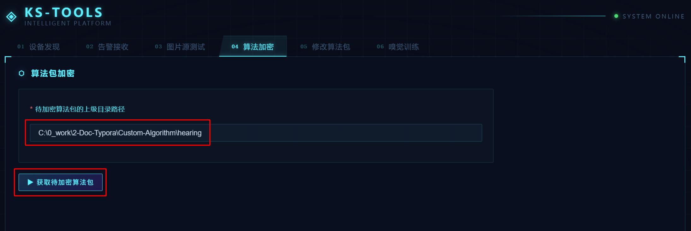
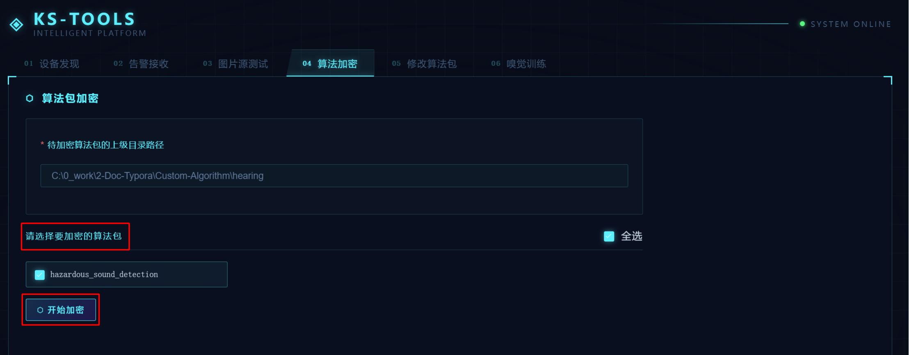
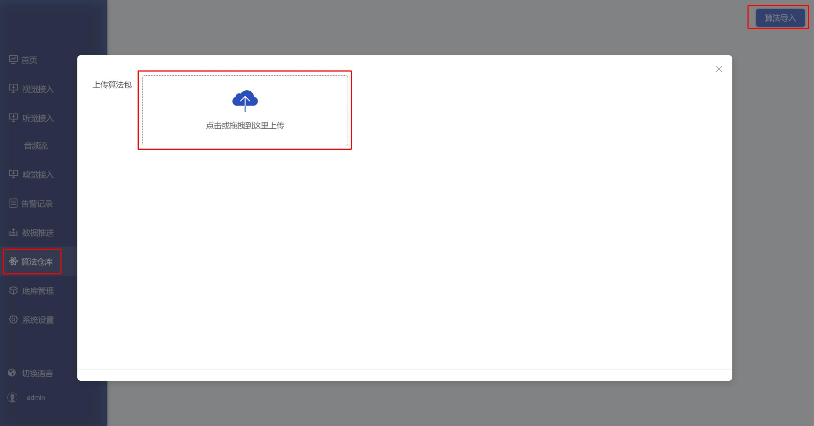

# QuickStart

This document uses the `hazardous_sound_detection` hazardous sound detection algorithm package as an example to explain how to quickly check the algorithm package structure, encrypt the package, and import it into the device.

> For model training, inference validation, ONNX export, ONNX simplification, RKNN conversion, and model file replacement, see [model_training_conversion.md](./model_training_conversion.md).

Example algorithm package path:

```text
AED/hazardous_sound_detection
```

## 1. Check the Algorithm Package Structure

Before encryption, confirm that the `AED/hazardous_sound_detection` algorithm package contains the following directories and files:

```text
AED/hazardous_sound_detection/
  metadata.json
  model/
    model.yaml
    zql_aed.py
    hazardous_sound_detection/
      model
  postprocessor_zh/
    hazardous_sound_detection.json
    postprocessor.yaml
  postprocessor_en/
    hazardous_sound_detection.json
    postprocessor.yaml
```

Description:

- `model/hazardous_sound_detection/model`: final RKNN model file. The file name must be `model`; do not keep the `.rknn` suffix.
- `model/zql_aed.py`: hearing RKNN inference code used by the current algorithm package.
- `model/model.yaml`: model instance configuration. The current model instance name is `hazardous_sound_detection`.
- `postprocessor_zh`: post-processing configuration for the Chinese UI.
- `postprocessor_en`: post-processing configuration for the English UI.
- `metadata.json`: algorithm package name, version, and algorithm category.

## 2. Obtain the Encryption Tool

Use the encryption tool provided in the repository:

[ks-tools.exe](../Tools/ks-tools/ks-tools.exe)

## 3. Encrypt the Algorithm Package

Open `ks-tools.exe` and enter the algorithm encryption module.

Select the parent directory of the algorithm package to be encrypted, instead of selecting the algorithm package directory itself.

For this example, select:

```text
Custom-Algorithm/hearing/AED
```

<div style="text-align: center;">
    
</div>

The tool will recognize the `hazardous_sound_detection` algorithm package under this directory. After confirming that the package name is correct, click Encrypt.

<div style="text-align: center;">
    
</div>

After encryption succeeds, a `.bin` file with the same name is generated. This `.bin` file is the final algorithm package file to import into the device.

## 4. Import the Algorithm Package

Log in to the `XiaoZhi JingLing` backend management system, open the Algorithm Repository, and import the encrypted `.bin` file.

<div style="text-align: center;">
    
</div>

After import, check the following items:

- Whether the algorithm name is consistent with `metadata.json` and `postprocessor_zh/postprocessor.yaml`.
- Whether the Chinese and English UI display names are correct.
- Whether the `Hazardous Sound Confidence` parameter is visible when binding the algorithm.
- Whether the voice broadcast text meets the project requirements.

## 5. Validate After Import

After binding the algorithm, run one validation test with an audio stream that contains target sound events:

- Claps, alarms, crashes, distress sounds, and traffic hazard sounds should trigger alarms.
- If there are too many false alarms, increase `conf_thres`.
- If there are too many missed detections, decrease `conf_thres` and check whether the training data covers the current scenario.

If the validation result does not match expectations, first refer to [model_training_conversion.md](./model_training_conversion.md) to check the model training and conversion workflow, and refer to [model.md](./model.md) to check the model instance name and post-processing category mapping.
