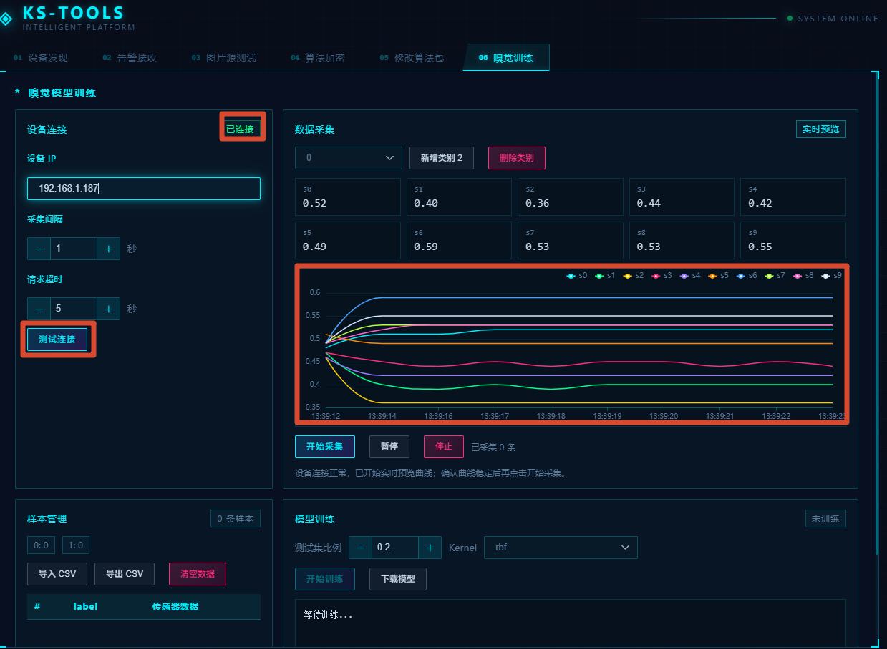
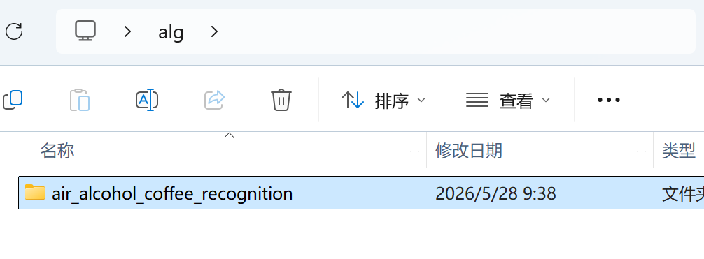
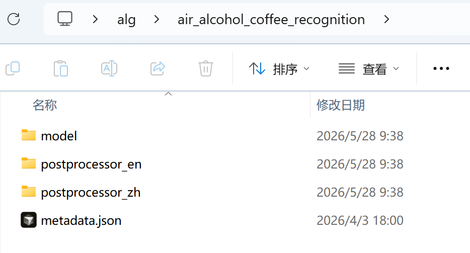
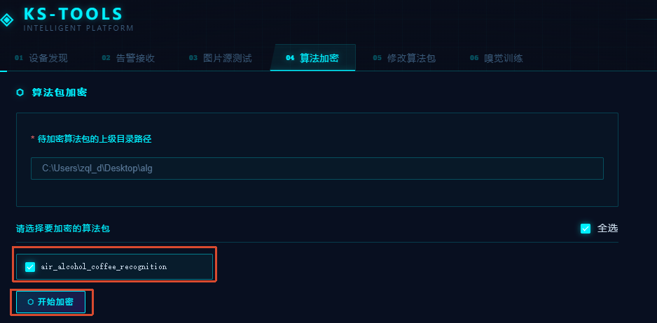
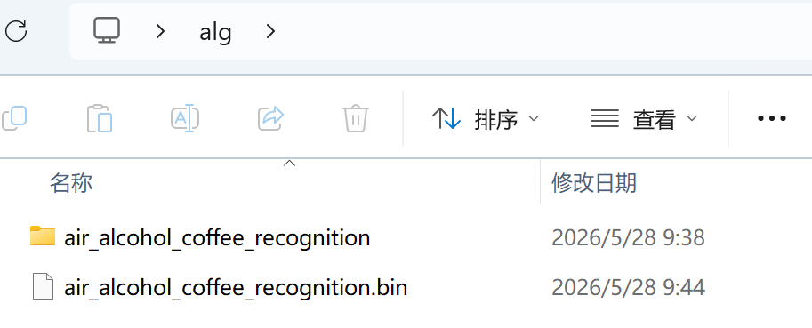
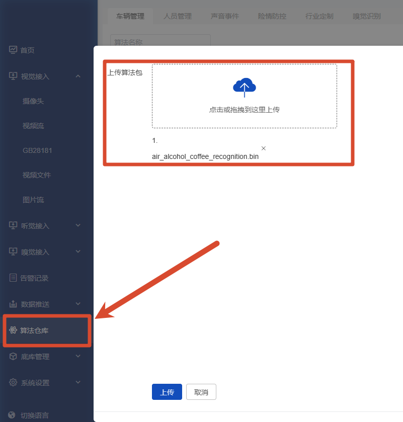

# QuickStart

This document uses the `Air Alcohol Coffee Recognition` algorithm as an example to introduce how to use `ks-tools.exe` to train a smell model, replace the model file, encrypt the algorithm package, and import it into the device.

Sample algorithm package path:

```text
SmellRecognition/air_alcohol_coffee_recognition
```

## 1. Obtain the ks-tools Tool

Download and extract the algorithm tool: [ks-tools.exe](../Tools/ks-tools/ks-tools.exe)。

Training, model export, and algorithm package encryption for smell algorithms are all completed through `ks-tools.exe`.

## 2. Collect Smell Samples

1. Open `ks-tools.exe`.
2. Make sure the Windows PC and the smell data collection device are on the same network.
3. Enter the smell device IP address in the tool and test the connection.
4. After the connection succeeds, the tool displays 10 channels of sensor data from `s0` to `s9`.
   <div style="text-align: center;">
    
   </div>
5. Set the class ID for the current odor, for example:
   - `0`: Air / normal environment
   - `1`: Alcohol
   - `2`: Coffee
6. Select the class corresponding to the current odor and start collection. The minimum collection interval is `1` second.

The CSV sample header is fixed as:

```text
label,s0,s1,s2,s3,s4,s5,s6,s7,s8,s9
```

## 3. Train and Export the Model

After the sample count meets the requirement, select `kernel` on the model training page of `ks-tools.exe` and start training. For first-time use, keep the default `rbf` setting.

After training is complete, download the model, rename the exported model file to `model`, and replace the file at:

```text
SmellRecognition/air_alcohol_coffee_recognition/model/zql_air_alcohol_coffee_recognition/model
```

## 4. Modify Algorithm Package Configuration

Update the following content according to the actual business scenario:

- `metadata.json`: algorithm package name, version, and category.
- `model/model.yaml`: model instance name, inference entry, and default confidence threshold.
- `postprocessor_zh/postprocessor.yaml`: Chinese class mapping, display colors, and alert labels.
- `postprocessor_en/postprocessor.yaml`: English class mapping, display colors, and alert labels.
- `postprocessor_zh/*.json` and `postprocessor_en/*.json`: UI configuration, voice broadcast, and model parameters.

The sample algorithm package recognizes 3 odor classes by default:

| Numeric Class | Internal Label | Chinese Meaning | English Meaning | Alert |
| --- | --- | --- | --- | --- |
| 0 | air | Air / normal environment | Air | No |
| 1 | alcohol | Alcohol | Alcohol | Yes |
| 2 | coffee | Coffee | Coffee | Yes |

## 5. Encrypt the Algorithm Package

Open `ks-tools.exe`, go to the algorithm encryption module, and select the parent directory of the algorithm package to be encrypted, for example:
Encryption of one or more algorithms is supported. This article uses the encryption of the `air_alcohol_coffee_recognition` algorithm package as an example.

<div style="text-align: center;">
    
</div>

- The internal structure of the algorithm package is as follows.
<div style="text-align: center;">
    
</div>

- Enter the path of ks-tools and the parent directory path where the algorithm package(s) are stored (do not specify a specific algorithm package), then click [获取待加密算法包].
<div style="text-align: center;">
    
</div>

- After clicking, the name(s) of the algorithm package(s) to be generated will be displayed below.
<div style="text-align: center;">
    
</div>


- Click【开始加密】to generate the algorithm package(s).

<div style="text-align: center;">
    
</div>

```text
SmellRecognition
```

Select `air_alcohol_coffee_recognition` and execute encryption. After encryption succeeds, a `.bin` file with the same name is generated.

## 6. Import into the Device

Import the generated `.bin` file into the algorithm repository of the tri-modal all-in-one device background management system, then complete algorithm binding, parameter configuration, and alert linkage.
<div style="text-align: center;">
    
</div>