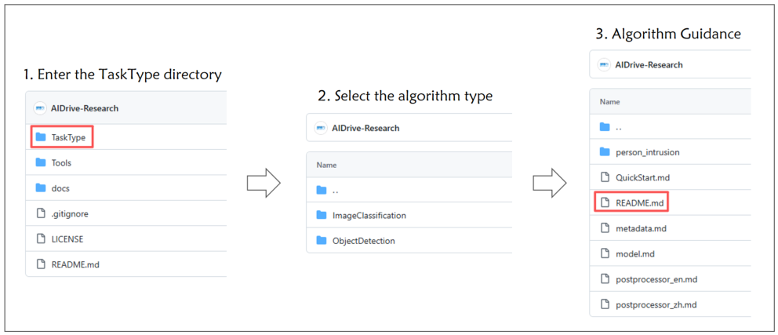

[ImageClassification](https://github.com/AIDrive-Research/Custom-Algorithm/tree/main/vision/TaskType/ImageClassification) | [InstanceSegmentation](https://github.com/AIDrive-Research/Custom-Algorithm/tree/main/vision/TaskType/InstanceSegmentation) | [ObjectDetection](https://github.com/AIDrive-Research/Custom-Algorithm/tree/main/vision/TaskType/ObjectDetection) | [ObjectTracking](https://github.com/AIDrive-Research/Custom-Algorithm/tree/main/TaskType/vision/ObjectTracking)

# 🔥 Custom Algorithm

## 📑Introduction

This repository provides algorithm developers with a **one-stop industrial-grade deployment solution** for algorithm models. This solution enables users to quickly import self-trained algorithm models into industrial-grade lightweight software and hardware all-in-one machines.

The all-in-one machine integrates a full set of core modules, including video/audio hardware decoding, a complete UI interaction system, a high-performance database, automatic model compression and reuse (which can improve computing efficiency), and information push functions. Users do not need complex operations—after completing model training, simply perform simple compression and format alignment, then drag and drop to import through the device's visual interface. This allows immediate access to the development convenience of  **low-cost hardware combined with high-performance computing**.

**This project is a tutorial that helps you import a pre-trained and quantized model into a highly available integrated software-hardware device for deployment.
(The model training and quantization processes should be completed by referring to the documentation of the neural network you choose and the quantization tutorial provided by Rockchip.)**

Regarding all content covered by this project, our company does not provide free after-sales services. Clients with sufficient technical expertise shall be able to complete the entire process independently by referring to the documentation and tutorials. The general after-sales staff in our support group are not qualified to address any inquiries related to this project. Should technical support be required, please contact our business personnel to purchase a service package, which is billed at a rate of 8 working hours per day.  

## 📦Quick Start

The operation process is as follows (as shown in the figure):  
Users only need to enter the TaskType folder, select the appropriate algorithm type from ObjectDetection/ImageClassification, follow the step-by-step guidance in the documents within the folder, modify or replace the corresponding files to complete the production of the algorithm package. After production, compress and package it, and it can be directly imported into the device for use.

## 📂Directory Structure

### [docs](../docs/)
This directory contains frequently asked questions and their answers, helping users quickly understand how to use the functions in this repository and resolve issues that may arise during use.

### [TaskType](../TaskType/)

This section provides code examples of algorithms with different functions, assisting users in customizing algorithms according to specific needs.
- Structure examples: Demonstrate how to organize the file structure of algorithm packages for easier understanding and customization.
- Parameter details: Explain the configuration parameters in algorithm packages in detail to facilitate custom adjustments.
- Covering links such as model training, conversion and quantization, and algorithm package encryption, helping users efficiently convert models.

