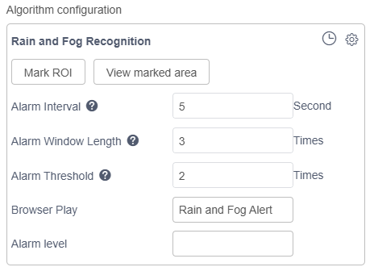
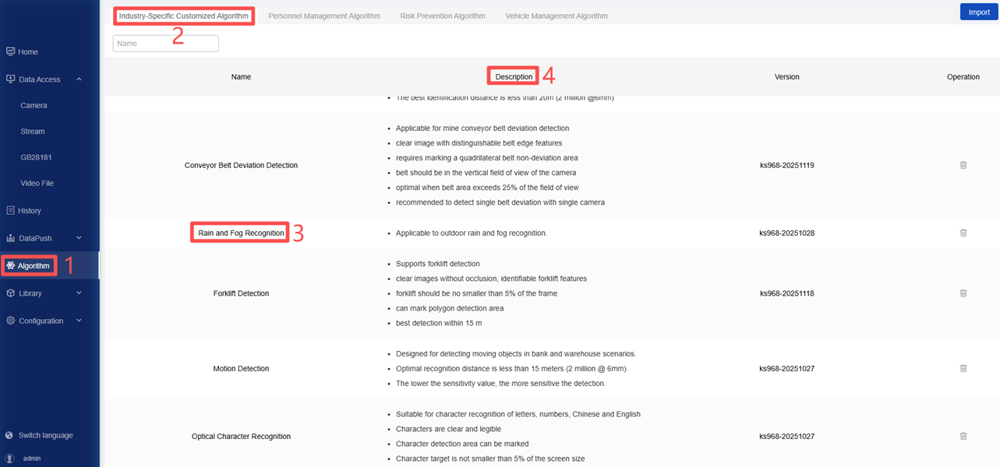

# postprocessor_en

`postprocessor_en`: Contains code related to algorithm post-processing. For example, functions such as the model’s ability to perform inference and recognition on the entire image or a selected region are implemented here. Instead, the alarm is triggered only when the person’s bounding box crosses the line. This type of functionality is implemented here. In addition, the content of this folder also determines the display effect of the front-end page (such as target frame color, language, etc.). When an English version of the algorithm package needs to be created, this folder must be included; otherwise, it can be deleted.

*If an English version of the algorithm package is not needed, this chapter can be skipped*  

The `postprocessor_en` folder contains 3 parts:
- Front-end configuration file: [fog.json](./fog/postprocessor_en/fog.json)
- Algorithm configuration file: [postprocessor.yaml](./fog/postprocessor_en/postprocessor.yaml)
- Post-processing code: [fog.py](./fog/postprocessor_en/fog.py) 

## 1. Front-end Configuration File: [fog.json](./fog/postprocessor_en/fog.json)

Used to define the parameters and their default values displayed on the interface when configuring the algorithm. As shown in the figure below:

  

**Custom Algorithm Requirements:** 

- Rename `fog.json` to [algorithm_package_name].json, for example: `custom_fog.json`;

- Modify `basicParams` -> `model_args` -> `custom_fog_classify` to the model name in the model folder;

- Modify `basicParams` -> `reserved_args` -> `display_name` to the displayed algorithm name;

- Modify `basicParams` -> `reserved_args` -> `sound_text` to the voice broadcast name;

- Modify `renderParams` -> `model_args` -> `custom_fog_classify` to the model name in the model folder;

- Modify `renderParams` -> `model_args` -> `custom_fog_classify` -> `conf_thres` -> `label` to the English name of the `conf_thres` parameter;

- Modify `renderParams` -> `model_args` -> `custom_fog_classify` -> `conf_thres` -> `tooltip` to the explanation of this parameter;

For a detailed explanation of the front-end configuration file parameters, see [Parameter Description](../../../docs/Postprocessor/README_JSON_en.md)  

## 2. Algorithm Configuration File: [postprocessor.yaml](./fog/postprocessor_en/postprocessor.yaml)

Some parameters are used for algorithm display, as shown in the figure below:
  

```bash
display_name: Rain and Fog Recognition
desc: Applicable to outdoor rain and fog recognition.
group_name: Industry-Specific Customized Algorithm
model:
  custom_fog_classify:
    inactive: true
    label:
      class2label:
        0: fog
        1: normal
        2: rain
alert_label: [ fog, rain ]
process_time: 10
```

**Custom Algorithm Requirements:**

- `display_name`: As shown in [3] in the figure, the algorithm name, which should be consistent with `display_name` in `fog.json`;

- `desc`: As shown in [4] in the figure, the algorithm description;

- `group_name`: As shown in [2] in the figure, the algorithm group;

- `model`: Model parameters;
    - `inactive`: `true` indicates that full-image inference is not performed, and the input data for secondary inference shall be specified in the post-processing file；
    - `class2label`: Specify the output categories and names of the model, which need to be modified to the output categories and names of the self-trained model;

- `alert_label`: Specify the alarm categories, which can also be defined in the post-processing file;

- `process_time`: The time required for post-processing, used to calculate the frame sampling interval.

## 3. Post-processing Code: [fog.py](./fog/postprocessor_en/fog.py) 

Responsible for parsing inference outputs, filtering targets, and generating final classification results. It contains 2 core functions: `_filter` and `_process`.

**Custom Algorithm Requirements:**  

- Rename `fog.py` to [algorithm_package_name].py, for example: `custom_fog.py`.
- If additional logical processing of the recognition results is required, you need to modify the code yourself.

Functions implemented by `fog.py`:

**`_filter`**

This function is used for preliminary processing of model inference results.

**`_process`**

This function is used to specify the recognition region for secondary inference, analyze the inference results, and determine whether to trigger an alarm.