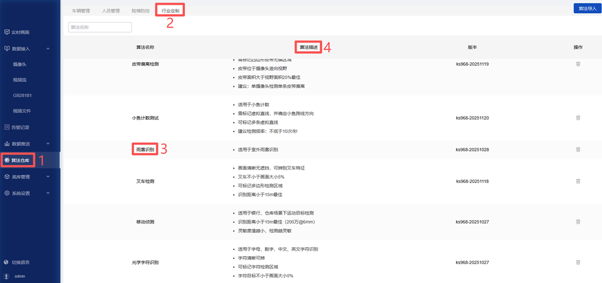

# postprocessor_zh

`postprocessor_zh`：包含算法后处理相关代码。例如，模型可对整个图片推理识别，或者对选择的区域识别，这类功能便在此实现。此外，该文件夹内容还会决定前端页面的展示效果（如目标框颜色、语言等）。当需要制作中文版算法包时，需包含该文件夹，否则可将其删除。

*若不需中文版算法包，可跳过该章节*  

该模块包含3部分内容：  
- 前端配置文件：[fog.json](./fog/postprocessor_zh/fog.json)
- 算法配置文件：[postprocessor.yaml](./fog/postprocessor_zh/postprocessor.yaml)
- 后处理代码：[fog.py](./fog/postprocessor_zh/fog.py) 

## 1. 前端配置文件：[fog.json](./fog/postprocessor_zh/fog.json)

用于定义在配置算法时，界面显示的参数及默认值。如下图： 

  

**自定义算法要求：**  

- `fog.json` 修改为 算法包名称.json，如：`custom_fog.json`；

- 将 `basicParams` -> `model_args` -> `custom_fog_classify` 修改为 `model` 文件夹中模型名称；

- 将 `basicParams` -> `reserved_args` -> `display_name` 修改为显示的算法名称；

- 将 `basicParams` -> `reserved_args` -> `sound_text` 修改为语音播报名称；

- 将 `renderParams` -> `model_args` -> `custom_fog_classify` 修改为 `model` 文件夹中模型名称；

- 将 `renderParams` -> `model_args` -> `custom_fog_classify` -> `conf_thres` -> `label` 修改为 `conf_thres`参数的中文名称；

- 将 `renderParams` -> `model_args` -> `custom_fog_classify` -> `conf_thres` -> `tooltip` 修改为对该参数的解释说明；

完整的前端配置文件参数说明，详见 [参数说明](../../../docs/Postprocessor/README_JSON_zh.md)

## 2. 算法配置文件：[postprocessor.yaml](./fog/postprocessor_zh/postprocessor.yaml)

部分参数用于算法展示。如下图：  
  

```bash
display_name: 雨雾识别
desc: "适用于室外雨雾识别"
group_name: 行业定制
model:
  custom_fog_classify:              
    inactive: true
    label:
      class2label:
        0: fog
        1: normal
        2: rain
alert_label: [ fog, rain ]
process_time: 10
```

**自定义算法要求：**  
- `display_name`: 如图【3】，算法名称，与 `fog.json` 中 `display_name` 保持一致；

- `desc`：如图【4】，算法描述；

- `group_name`：如图【2】，算法分组；

- `model`：模型参数； 
    - `inactive`: `true` 表示不推理全图，在后处理文件中指定二次推理的输入数据；
    - `class2label`：指定模型的输出类别、名称，需修改为自训练模型的输出类别和名称；

- `alert_label`：指定告警类别，也可在后处理文件中定义；

- `process_time`：后处理所需的时间，用于计算抽帧间隔。

## 3. 后处理代码：[fog.py](./fog/postprocessor_zh/fog.py) 

负责解析推理输出、筛选目标并生成最终识别结果。包含2个核心函数：`_filter`、`_process`。

**自定义算法要求：**  

- `fog.py` 修改为 算法包名称.py，如：`custom_fog.py`。 
- 若需要对识别结果做其他逻辑处理，需自行修改代码。

`fog.py`实现的功能：

**`_filter`**

该函数用于获取模型推理的结果。

**`_process`**

该函数用于指定识别区域，进行二次推理。并分析推理结果，判断是否产生告警。
