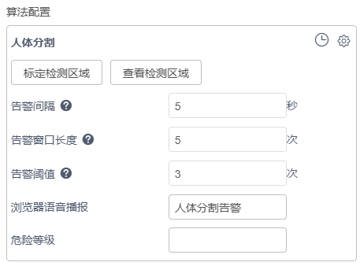
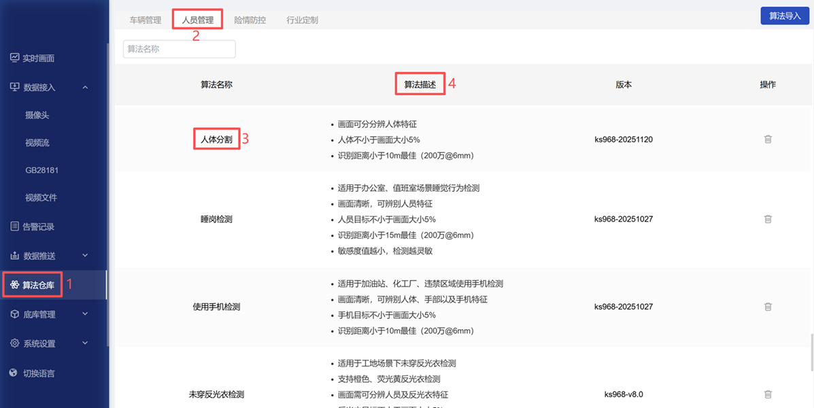

# postprocessor_zh

`postprocessor_zh`：包含算法后处理相关代码。例如，模型实时分割人体区域，绘制目标轮廓并即时产生告警。此外，该文件夹内容还会决定前端页面的展示效果（如目标框颜色、语言等）。当需要制作中文版算法包时，需包含该文件夹，否则可将其删除。

*若不需中文版算法包，可跳过该章节*  

该模块包含3部分内容：  
- 前端配置文件：[person_segmentation.json](./person_segmentation/postprocessor_zh/person_segmentation.json)
- 算法配置文件：[postprocessor.yaml](./person_segmentation/postprocessor_zh/postprocessor.yaml)
- 后处理代码：[person_segmentation.py](./person_segmentation/postprocessor_zh/person_segmentation.py) 

## 1. 前端配置文件：[person_segmentation.json](./person_segmentation/postprocessor_zh/person_segmentation.json)

用于定义在配置算法时，界面显示的参数及默认值。如下图： 

  

**自定义算法要求：**  

- `person_segmentation.json` 修改为 算法包名称.json，如：`custom_segmentation.json`；

- 将 `basicParams` -> `model_args` -> `custom_segment` 修改为 `model` 文件夹中模型名称；

- 将 `basicParams` -> `reserved_args` -> `display_name` 修改为显示的算法名称；

- 将 `basicParams` -> `reserved_args` -> `sound_text` 修改为语音播报名称；

- 将 `renderParams` -> `model_args` -> `custom_segment` 修改为 `model` 文件夹中模型名称；

- 将 `renderParams` -> `model_args` -> `custom_segment` -> `conf_thres` -> `label` 修改为 `conf_thres`参数的中文名称；

- 将 `renderParams` -> `model_args` -> `custom_segment` -> `conf_thres` -> `tooltip` 修改为对该参数的解释说明；

完整的前端配置文件参数说明，详见 [参数说明](../../../docs/Postprocessor/README_JSON_zh.md)

## 2. 算法配置文件：[postprocessor.yaml](./person_segmentation/postprocessor_zh/postprocessor.yaml)

部分参数用于算法展示。如下图：  
  

```bash
display_name: 人体分割
desc: "画面可分分辨人体特征;人体不小于画面大小5%;识别距离小于10m最佳（200万@6mm）"
group_name: 人员管理
model:
  custom_segment:                  # 模型名称，model内模型文件夹名字
    label:
      class2label:
        0: person
      label_map:
        person: 人
      label2color:
        人: [ 0, 255, 0 ]
alert_label: [ 人 ]
process_time: 10
```

**自定义算法要求：**  
- `display_name`: 如图【3】，算法名称，与 `person_segmentation.json` 中 `display_name` 保持一致；

- `desc`：如图【4】，算法描述；

- `group_name`：如图【2】，算法分组；

- `model`：模型参数；  
    - `class2label`：指定模型的输出类别、名称，需修改为自训练模型的输出类别和名称；
    - `label_map`：输出对应的界面显示名称；
    - `label2color`：不同类别默认的矩形框颜色。

- `alert_label`：指定告警类别，也可在后处理文件中定义。

- `process_time`：后处理所需的时间，用于计算抽帧间隔。

## 3. 后处理代码：[person_segmentation.py](./person_segmentation/postprocessor_zh/person_segmentation.py) 

负责解析推理输出、筛选目标并生成最终结果。包含2个核心函数：`_filter`、`_process`。

**自定义算法要求：**  

- `person_segmentation.py` 修改为 算法包名称.py，如：`custom_segmentation.py`。  
- 若需要对推理结果做其他逻辑处理，需自行修改代码。

`person_segmentation.py`实现的功能：

**`_filter`**

该函数用于初步处理模型推理的结果，完成对目标的多条件过滤，包括：置信度低于阈值的目标、不在配置列表中的目标、不在指定多边形内的目标。 

**`_process`**

该函数处理模型分割结果，生成轮廓点，产生告警。