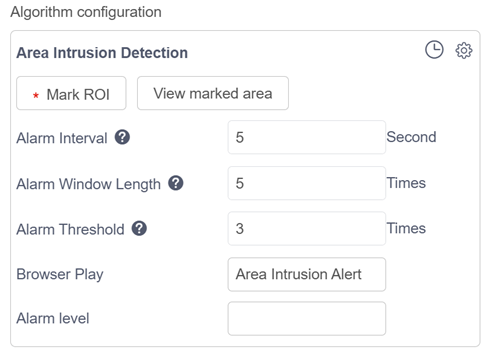
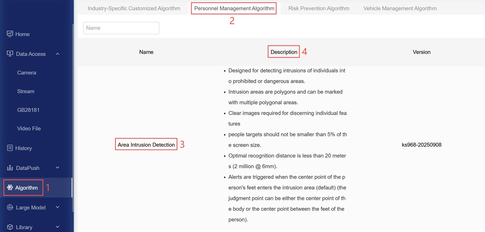

# postprocessor_en

`postprocessor_en`: Contains code related to algorithm post-processing. For example, functions such as not triggering an alarm directly when the model recognizes a human body, but only triggering an alarm when the human body frame overlaps with a specific area frame, are implemented here. In addition, the content of this folder also determines the display effect of the front-end page (such as target frame color, language, etc.). When an English version of the algorithm package needs to be created, this folder must be included; otherwise, it can be deleted.

*If an English version of the algorithm package is not needed, this chapter can be skipped*  

The `postprocessor_en` folder contains 3 parts:
- Front-end configuration file: [person_intrusion.json](./person_intrusion/postprocessor_en/person_intrusion.json)
- Algorithm configuration file: [postprocessor.yaml](./person_intrusion/postprocessor_en/postprocessor.yaml)
- Post-processing code: [person_intrusion.py](./person_intrusion/postprocessor_en/person_intrusion.py) 

## 1. Front-end Configuration File: [person_intrusion.json](./person_intrusion/postprocessor_en/person_intrusion.json)

Used to define the parameters and their default values displayed on the interface when configuring the algorithm. As shown in the figure below:

  

**Custom Algorithm Requirements:** 

- Rename `person_intrusion.json` to [algorithm_package_name].json, for example: `custom_intrusion.json`;

- Modify `basicParams` -> `model_args` -> `custom_person` to the model name in the model folder;

- Modify `basicParams` -> `reserved_args` -> `display_name` to the displayed algorithm name;

- Modify `basicParams` -> `reserved_args` -> `sound_text` to the voice broadcast name;

- Modify `renderParams` -> `model_args` -> `custom_person` to the model name in the model folder;

- Modify `renderParams` -> `model_args` -> `custom_person` -> `conf_thres` -> `label` to the English name of the `conf_thres` parameter;

- Modify `renderParams` -> `model_args` -> `custom_person` -> `conf_thres` -> `tooltip` to the explanation of this parameter;

For a detailed explanation of the front-end configuration file parameters, see [Parameter Description](../../../docs/Postprocessor/README_JSON_en.md)  

## 2. Algorithm Configuration File: [postprocessor.yaml](./person_intrusion/postprocessor_en/postprocessor.yaml)

Some parameters are used for algorithm display, as shown in the figure below:
  

```bash
display_name: Area Intrusion Detection
desc: "Designed for detecting intrusions of individuals into prohibited or dangerous areas.;Intrusion areas are polygons and can be marked with multiple polygonal areas.;Clear images required for discerning individual features; people targets should not be smaller than 5% of the screen size.;Optimal recognition distance is less than 20 meters (2 million @ 6mm).;Alerts are triggered when the center point of the person's feet enters the intrusion area (default) (the judgment point can be either the center point of the body or the center point between the feet of the person)."
group_name: Personnel Management Algorithm
model:
  custom_person:
    label:
      class2label:
        0: person
      label_map:
        person: Person
      label2color:
        Person: [ 0, 255, 0 ]
alert_label: [ ]
process_time: 10
```

**Custom Algorithm Requirements:**

- `display_name`: As shown in [3] in the figure, the algorithm name, which should be consistent with `display_name` in `person_intrusion.json`;

- `desc`: As shown in [4] in the figure, the algorithm description;

- `group_name`: As shown in [2] in the figure, the algorithm group;

- `model`: Model parameters;
    - `class2label`: Specify the output categories and names of the model, which need to be modified to the output categories and names of the self-trained model;
    - `label_map`: The display names corresponding to the outputs on the interface;
    - `label2color`: The default rectangle frame colors for different categories.

- `alert_label`: Specify the alarm categories, which can also be defined in the post-processing file.

- `process_time`: The time required for post-processing, used to calculate the frame sampling interval.

## 3. Post-processing Code: [person_intrusion.py](./person_intrusion/postprocessor_en/person_intrusion.py) 

Responsible for parsing inference outputs, filtering targets, and generating final detection results. It contains 2 core functions: `_filter` and `_process`.

**Custom Algorithm Requirements:**  

- Rename `person_intrusion.py` to [algorithm_package_name].py, for example: `custom_intrusion.py`.
- If other logical processing of the detection results is required, the code needs to be modified by yourself.

Functions implemented by `person_intrusion.py`:

**`_filter`**

This function is used for preliminary processing of model inference results, completing multi-condition filtering of targets, including: targets with confidence below the threshold, targets not in the configuration list, and targets not in the specified polygon.

**`_process`**

This function judges whether the model detection results are within the marked area, and generates an alarm if they are within the area.