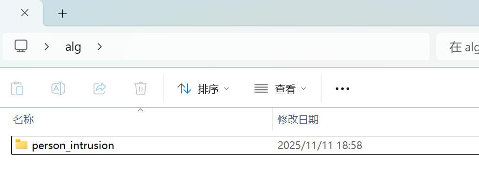
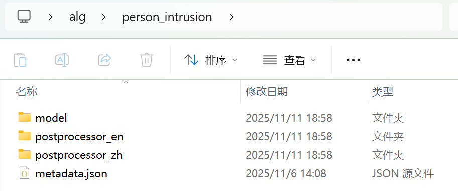
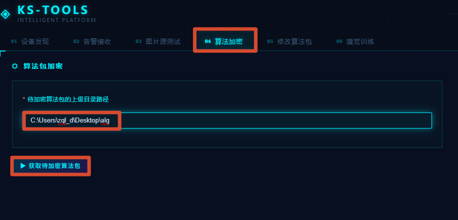
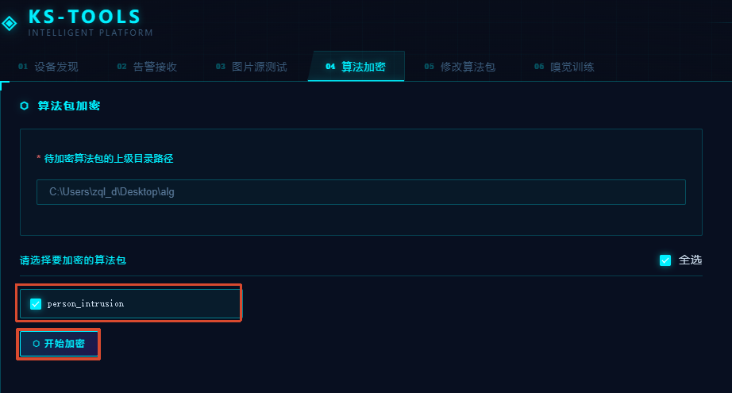
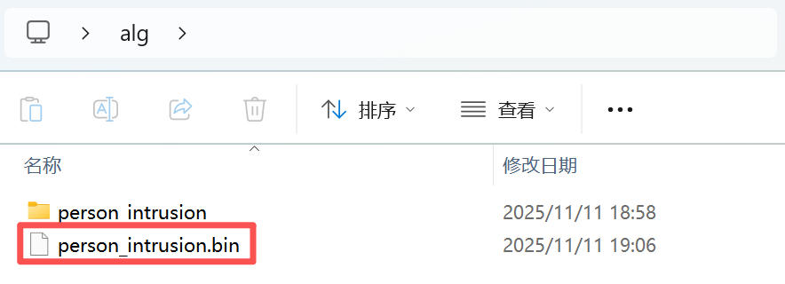
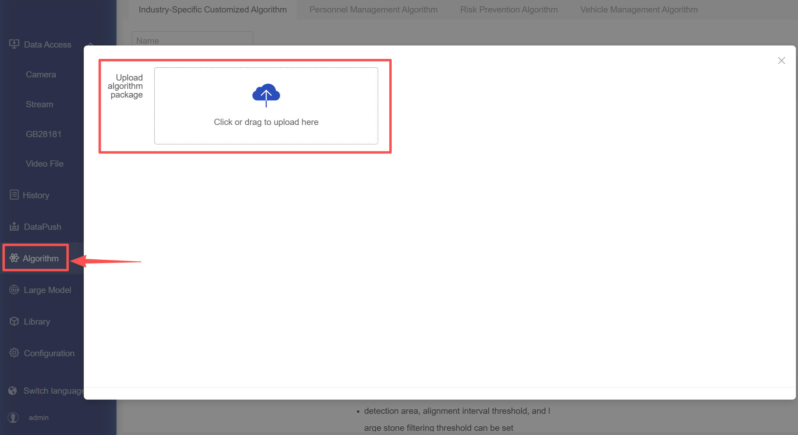

# QuickStart

This article takes the `person_intrusion` algorithm as an example (an alarm is triggered when a person enters a specific area) to introduce how to package and import the algorithm into the device.

## 1. Obtain the Encryption Tool

Download the algorithm package encryption tool: [ks-tools.exe](../../../Tools/ks-tools/ks-tools.exe) 。

## 2. Encrypt the Algorithm Package

Place the algorithm package(s) to be encrypted in a folder (the folder can contain multiple algorithm packages), enter the parent path of the algorithm package(s) to be encrypted. A prompt will display the name(s) of the algorithm package(s) to be encrypted.

Encryption of one or more algorithms is supported. This article uses the encryption of the `person_intrusion` algorithm package as an example.

    

- The internal structure of the algorithm package is as follows.

    

- Enter the path of ks-tools and the parent directory path where the algorithm package(s) are stored (do not specify a specific algorithm package), then click [获取待加密算法包].

    

- After clicking, the name(s) of the algorithm package(s) to be generated will be displayed below.

    

- Click【开始加密】to generate the algorithm package(s).

    

## 3. Import the Algorithm Package
- The encrypted `bin` file is the final file. Import it through the `Algorithm` in the background management system.

    

